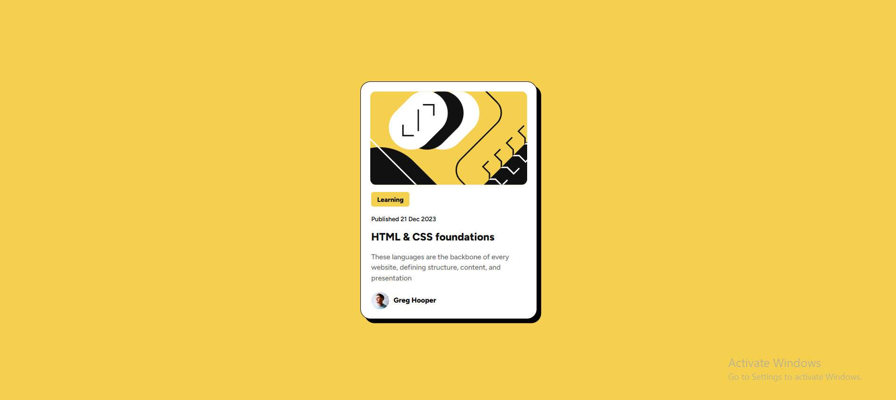

# Frontend Mentor - Blog preview card solution

This is a solution to the [Blog preview card challenge on Frontend Mentor](https://www.frontendmentor.io/challenges/blog-preview-card-ckPaj01IcS). 

## Table of contents

- [Overview](#overview)
  - [The challenge](#the-challenge)
  - [Screenshot](#screenshot)
  - [Links](#links)
- [My process](#my-process)
  - [Built with](#built-with)

## Overview

### The challenge

Users should be able to:

- View the desktop and responsive version of this design
- See, hover and focus states for all interactive elements on the page

### Screenshot

A screenshot of the solution is shown above. The design features a blog preview card with a clean and simple layout.It has headings, text and button.The solution is responsive, ensuring a smooth experience on both desktop and mobile devices.

### Links

- Solution URL: [Add solution URL here](https://tatia-idukashvili.github.io/Blog-preview-card/)

## My process

### Built with

- Semantic HTML5 markup
- CSS custom properties
- Flexbox